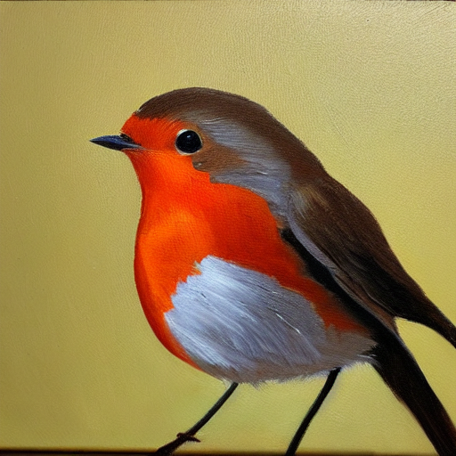

<p align="center" width="100%">

</p>

# LMFlow

<h4 align="center">
    <p>
        <b>English</b> |
        <a href="https://github.com/OptimalScale/LMFlow/blob/main/readme/README_zh-hans.md">简体中文</a> |
        <a href="https://github.com/OptimalScale/LMFlow/blob/main/readme/README_es.md">Español</a> |
        <a href="https://github.com/OptimalScale/LMFlow/blob/main/readme/README_jp.md">日本語</a> |
        <a href="https://github.com/OptimalScale/LMFlow/blob/main/readme/README_ko.md">한국어</a> |
        <a href="https://github.com/OptimalScale/LMFlow/blob/main/readme/README_hindi.md">हिंदी</a>
    <p>
</h4>

[](https://lmflow.com)
[](https://github.com/OptimalScale/LMFlow/blob/main/LICENSE)
[](https://www.python.org/downloads/release/python-390/)
[](https://optimalscale.github.io/LMFlow/)
[](https://discord.gg/u9VJNpzhvA)
[](https://join.slack.com/t/lmflow/shared_invite/zt-1s6egx12s-THlwHuCjF6~JGKmx7JoJPA)
[](https://i.imgloc.com/2023/06/22/VIt6AF.jpeg)

An extensible, convenient, and efficient toolbox for finetuning large machine learning models, designed to be user-friendly, speedy and reliable, and accessible to the entire community.

Large Model for All. See our [vision](https://github.com/OptimalScale/LMFlow#vision).

<p align="center" width="100%">

</p>


## Latest News
* [2023-06-22] :rocket: [LMFlow paper](https://arxiv.org/abs/2306.12420) is out! Check out our implementation details at https://arxiv.org/abs/2306.12420 :rocket:
* [2023-06-16] :rocket: Our finetuned Robin-33B-V2 scored an impressive 64.1 on the Huggingface LLM leaderboard in our offline evaluation, outperforming major open-source LLMs! All checkpoints (7B, 13B, 33B, and 65B) are [released](https://huggingface.co/OptimalScale)! Checkout the performance [here](https://medium.com/@hkust.ml/robin-v2-launches-achieves-unparalleled-performance-on-openllm-4f6886e822c1).  :rocket:
* [2023-06-07] LMFlow is now officially available on PyPI! Install it with `pip install lmflow-finetune`!
* [2023-05-30] Release [Robin-13B-v2](https://huggingface.co/OptimalScale/robin-13b-v2-delta) and [Robin-33B-v2](https://huggingface.co/OptimalScale/robin-33b-v2-delta)!
* [2023-05-15] Release [LMFlow-data](http://lmflow.org:5000/lmflow_data.tar.gz), the training dataset of Robin-7B-v2. A new [test data](http://lmflow.org:5000/lmflow_chat_en_dialog_multiturn_single_nll_text2text.tar.gz) is also released.
* [2023-05-09] Release [Robin-7B-v2](http://lmflow.org:5000/robin-7b-v2-delta.tar.gz), achieving competitive performance on chitchat, commonsense reasoning and instruction-following tasks. Refer to our [comprehensive study](https://medium.com/@hkust.ml/lmflow-benchmark-an-automatic-evaluation-framework-for-open-source-llms-ef5c6f142418).
* [2023-05-08] Release [LMFlow Benchmark](https://medium.com/@hkust.ml/lmflow-benchmark-an-automatic-evaluation-framework-for-open-source-llms-ef5c6f142418), an automatic evaluation framework for open-source chat-style LLMs. [Benchmark results](https://docs.google.com/spreadsheets/d/1JYh4_pxNzmNA9I0YM2epgRA7VXBIeIGS64gPJBg5NHA/edit#gid=0) on 31 popular models are reported. [Participate in LMFlow Benchmark](https://github.com/OptimalScale/LMFlow#33-lmflow-benchmark).
* [2023-04-21] Release [Robin-7B](http://lmflow.org:5000/robin-7b.tar.gz) (based on LLaMA-7B), and two models for commercial use: Parakeets-2.7B (based on GPT-NEO-2.7B) and Cokatoo-7B (based on StableLM-7B) [Download here](https://github.com/OptimalScale/LMFlow/tree/main#model-zoo)
* [2023-04-10] We propose a new alignment algorithm: [Reward rAnked FineTuning (RAFT)](https://optimalscale.github.io/LMFlow/examples/raft.html), which is more efficient than conventional (PPO-based) RLHF. [[Paper](https://arxiv.org/abs/2304.06767)]
* [2023-04-02] [Web service](https://lmflow.com/) is online!
* [2023-04-01] Release three instruction-tuned checkpoints and three medical checkpoints in [model zoo](https://github.com/OptimalScale/LMFlow#model-zoo): LLaMA-7B-tuned, LLaMA-13B-tuned, LLaMA-33B-tuned, LLaMA-7B-medical, LLaMA-13B-medical, and LLaMA-33B-medical.
* [2023-03-27] Release code and checkpoints - [version 0.0.1](https://optimalscale.github.io/LMFlow/)! [Our tasked-tuned model beats ChatGPT on medical domain](https://github.com/OptimalScale/LMFlow#model-performance).
<!-- * [2023-03-27] Support full tuning and lora tuning for all decoder models.
* [2023-03-27] [Tasked tuned model beats ChatGPT on medical domain](https://github.com/OptimalScale/LMFlow#model-performance). -->
<!-- * [2023-04-15] Inference: Support streaming output and ChatGLM. -->

## Demos


We provide four kinds of demos which include
- Online Service: If you don't want to run any code and just want to try our models, we deploy our instruction-tuned LLaMA you to have a try.
- Colab Chatbot (shell): An interactive shell-based chatbot for you to easily deploy a chatbot on colab.
- Colab Chatbot (web): An interactive web-based chatbot for you to easily deploy your own chatbot on colab.
- Local Deploy: We also provide a way for you to deploy your model/chatbot locally, which means you can deploy much larger model than previous three methods if you have enough resource.


[](https://lmflow.com)
[%20%20chatbot:%20gpt--neo-orange?logo=google-colab&amp)](https://colab.research.google.com/drive/1P9Hf6_mLE7WHH92pw73j9D5kz6GTdkow?usp=sharing)
[%20%20chatbot:%20gpt--neo-blue?logo=google-colab&amp)](https://colab.research.google.com/drive/1LLtiiQO-ZIIFsTKxYzGWYX9BDRc-v8dq?usp=sharing)
[%20%20RAFT:%20diffusion-blueviolet?logo=google-colab&amp)](https://colab.research.google.com/drive/1bQmlSiKnqFjrkijFUJ5ylbYW-zUwObqL#scrollTo=9U2P_PUN-5xX)


### Online Service
Welcome to visit our [web service](https://lmflow.com/). We deploy LLaMA-7B-tuned model online for preview. Due to the high website traffic, sometimes the website may fail to respond. You can also deploy the chatbot following `Local Deploy`.

### Colab chatbot (shell)
<p align="center" width="100%">

</p>


We provide a simple shell demo of chatbot with Google Colab's T4/P100/V100 GPU.
Notice that the provided gpt-neo-2.7b model is **a rather weak model**, which only supports English and may sometimes generate
unsatisfactory responses. To improve the performance, users can use their own
dataset to finetune and obtain a better model with LMFlow. One can also try
other available decoder-only models provided in
🤗 [Hugging Face](https://huggingface.co/models?pipeline_tag=text-generation&sort=downloads), by

```sh
./scripts/run_chatbot.sh {another-model-name}
```
### Colab chatbot (web)
We provide a simple web demo of chatbot with Google Colab's T4/P100/V100 GPU.
Notice that the provided gpt-neo-2.7b model is **a rather weak model**, which only supports English and may sometimes generate
unsatisfactory responses.


### Local Deploy
If you have resources and want to deploy your own model locally. We provide you an easy way to run a flask server to launch a backend (to further provide services to other frontend) and an interactive web frontend (to let you communicate directly) by
```sh
./scripts/run_app.sh
```

We also provide a gradio-based UI for building chatbots. Running the following command will launch the demo for robin-7b:

```sh
pip install gradio
python ./examples/chatbot_gradio.py --deepspeed configs/ds_config_chatbot.json --model_name_or_path YOUR-LLAMA  --lora_model_path ./robin-7b --prompt_structure "A chat between a curious human and an artificial intelligence assistant. The assistant gives helpful, detailed, and polite answers to the human's questions.###Human: {input_text}###Assistant:"       --end_string "#" --max_new_tokens 200
```

We also hosted it on Hugging Face [Space](https://huggingface.co/spaces/OptimalScale/Robin-7b).


### Colab RAFT-diffusion

We also provide a simple demo to display the effectiveness of RAFT algorithm on diffusion models.
You can refer to either [Colab link](https://colab.research.google.com/drive/1bQmlSiKnqFjrkijFUJ5ylbYW-zUwObqL#scrollTo=9U2P_PUN-5xX) or `experimental/RAFT-diffusion/SD256-RAFT.ipynb`.
The support of multi-modal training of LMFlow is under development.

## Medical Performance

|                |  PubMedQA (ID) | MedQA-USMLE (OOD) | MedMCQA (ID) |  Average |
|:---------:|:--------:|:-----------:|:-------:|:----:|
| Human (pass)   |  60.0   |     50.0    |         |      |
| Human (expert) |    78.0   |     87.0    |  90.0   | 85.0 |
|   |      |              |    |  |
|  InstructGPT 175B   |   73.2   |     46.0    |  44.0   | 54.4 |
|    ChatGPT |    63.9   |     **57.0**    |  44.7   | 55.2 |
|      LLaMA 7B   |    5.2   |     27.1    |  24.3   | 18.9 |
|      LLaMA 33B |    1.8   |     43.4    |  30.3   | 25.2 |
|   |      |             |            |    |  |
|   Task-tuned LLaMA 7B (Full) |   **75.1**   |     44.5    |  49.9   | 56.5 |
| Task-tuned LLaMA 33B (LoRA) |  74.0  |  51.3   | **50.2**|**58.5**|

The LLaMA 33B (LoRA) performance is achieved with only **~16h** finetuning on the training split of PubMedQA and MedMCQA with a single 8 \* A100 server.
For more performance, including instruction tuning results, please refer to our [Documentation](https://optimalscale.github.io/LMFlow/).


## Model Zoo
We open-sourced the trained checkpoints to everyone for further training and inference.

<table>
<tr>
  <td align="center"></td>
  <td align="center"><a href="https://lmflow.org:10001/robin-7b.tar.gz" target="_blank"></a></td>
  <td align="center"><a href="https://lmflow.org:10001/llama13b-lora-380k.tar.gz" target="_blank"></a></td>
  <td align="center"><a href="https://lmflow.org:10001/llama30b-lora-170k.tar.gz" target="_blank"></a></td>
  <td align="center"><a href="" target="_blank"></a></td>
</tr>
<tr>
  <td width="160" align="center">Model<br />Base Model</td>
  <td width="160" align="center"><a href="https://lmflow.org:10001/robin-7b.tar.gz">Robin-7B :star: </a><br />LLaMA-7B</td>
  <td width="160" align="center"><a href="https://lmflow.org:10001/llama13b-lora-380k.tar.gz">Robin-13B</a><br />LLaMA-13B</td>
  <td width="160" align="center"><a href="https://lmflow.org:10001/llama30b-lora-170k.tar.gz">Robin-33B</a><br />LLaMA-33B</td>
  <td width="160" align="center"><a href="">Robin-65B</a><br />LLaMA-65B</td>
</tr>
<tr>
  <td align="center"></td>
  <td align="center"><a href="https://lmflow.org:10001/llama7b-lora-medical.tar.gz" target="_blank"></a></td>
  <td align="center"><a href="https://lmflow.org:10001/llama13b-lora-medical.tar.gz" target="_blank"></a></td>
  <td align="center"><a href="https://lmflow.org:10001/llama30b-lora-medical.tar.gz" target="_blank"></a></td>
  <td align="center"><a href="" target="_blank"></a></td>
</tr>
<tr>
  <td width="160" align="center">Model<br />Base Model</td>
  <td width="160" align="center"><a href="https://lmflow.org:10001/llama7b-lora-medical.tar.gz">Robin-7B-medical</a><br />LLaMA-7B</td>
  <td width="160" align="center"><a href="https://lmflow.org:10001/llama13b-lora-medical.tar.gz">Robin-13B-medical</a><br />LLaMA-13B</td>
  <td width="160" align="center"><a href="https://lmflow.org:10001/llama30b-lora-medical.tar.gz">Robin-33B-medical</a><br />LLaMA-33B</td>
  <td width="160" align="center"><a href="">Robin-65B-medical</a><br />LLaMA-65B</td>
</tr>
<tr>
  <td align="center"></td>
  <td align="center"><a href="https://lmflow.org:10001/parakeets-2.7b.tar.gz" target="_blank"></a></td>
  <td align="center"><a href="" target="_blank"></a></td>
  <td align="center"><a href="https://lmflow.org:10001/cockatoo-7b.tar.gz" target="_blank"></a></td>
  <td align="center"></a></td>
</tr>
<tr>
  <td width="160" align="center">Model<br />Base Model</td>
  <td width="160" align="center"><a href="https://lmflow.org:10001/parakeets-2.7b.tar.gz">Parakeets-2.7B :star: </a><br />GPT-NEO-2.7B</td>
  <td width="160" align="center"><a href="">Cockatoo-3B</a><br />StableLM-3B</td>
  <td width="160" align="center"><a href="https://lmflow.org:10001/cockatoo-7b.tar.gz">Cockatoo-7B :star: </a><br />StableLM-7B</td>
  <td width="160" align="center"><br /></td>
</tr>
</table>


## Supported Pipelines

| Pipelines   |   Status |
|----------|:-------------:|
| Task Tuning |  :white_check_mark: Supported |
| Instruction Tuning |  :white_check_mark: Supported |
| Parameter-Efficient Tuning |  :white_check_mark: Supported |
| Alignment Tuning |  :white_check_mark: Supported |
| Large Model Inference |  :white_check_mark: Supported |

## Supported Models

Seamlessly supported all the [decoder models](https://huggingface.co/models?pipeline_tag=text-generation&sort=downloads) in 🤗 Hugging Face.
LLaMA, GPT2, GPT-Neo, Galactica, have been fully tested. We will support encoder models soon.


## 1.Setup

Our package has been fully tested on Linux OS (Ubuntu 20.04). Other OS platforms (MacOS, Windows) are not fully tested.
You may encounter some unexpected errors. You may try it first on a Linux machine or use Google Colab to experience it.

```bash
git clone https://github.com/OptimalScale/LMFlow.git
cd LMFlow
conda create -n lmflow python=3.9 -y
conda activate lmflow
conda install mpi4py
pip install -e .
```

## 2.Prepare Dataset

Please refer to our [doc](https://optimalscale.github.io/LMFlow/examples/DATASETS.html).

## 3. Running Scripts
### 3.1 Finetuning

You can run `scripts/run_finetune.sh` to finetune a GPT-2 base model
```sh
./scripts/run_finetune.sh
```

If you would like to provide arguments for deepspeed to reflect your machine
settings, you may pass the corresponding deepspeed arguments to the script. For
example,
```sh
./scripts/run_finetune.sh "--num_gpus=8 --master_port 10001"
```

To enable LoRA finetuning, you may refer to
```sh
./scripts/run_finetune_with_lora.sh
```
which can be run in similar manner.

For detailed configurations, one may modify these scripts directly. These
scripts actually just call python script `examples/finetune.py`, which can
be run in following manner,

```sh
deepspeed ${deepspeed_args} \
  examples/finetune.py \
    --deepspeed configs/ds_config_zero3.json \
    --bf16 \
    --run_name finetune_with_lora \
    --model_name_or_path facebook/galactica-1.3b \
    --num_train_epochs 0.01 \
    --learning_rate 2e-5 \
    --dataset_path ${dataset_path} \
    --per_device_train_batch_size 1 \
    --per_device_eval_batch_size 1 \
    --validation_split_percentage 0 \
    --logging_steps 20 \
    --block_size 512 \
    --do_train \
    --output_dir output_models/finetune \
    --overwrite_output_dir \
    --ddp_timeout 72000 \
    --save_steps 5000 \
    --dataloader_num_workers 1
```
Here we set number of epochs `--num_train_epochs` to `0.01` so that the
finetuning process can be finished quickly. If you wish to obtain a model with
better performance, feel free to adjust those hyperparameters. You may run
```python
python examples/finetune.py -h
```
Note: In the case of a small training data set, the value of ``block_size`` needs to be reduced, otherwise there will be no samples available in the Epoch iterator.

to view all possible finetuning arguments. The finetuned model checkpoint will
be saved in the argument specified by `--output_dir`, which is
`output_models/finetune` in the above example.
We follow [Alpaca](https://github.com/tatsu-lab/stanford_alpaca) and [Vicuna](https://github.com/lm-sys/FastChat) in the model tuning process and serve the model in our web service.

### 3.2 Evaluation

One can directly run evaluation with an existing Hugging Face model, e.g. to run
GPT2 large, one may execute
```sh
./scripts/run_evaluation.sh
```
or run the corresponding python script
```python
CUDA_VISIBLE_DEVICES=0 \
    deepspeed examples/evaluate.py \
    --answer_type medmcqa \
    --model_name_or_path gpt2-large \
    --dataset_path data/MedQA-USMLE/validation \
    --deepspeed examples/ds_config.json
```
To load the finetuned model, specify `--model_name_or_path` with the saved
model checkpoint directory path.

For LoRA finetuned models, one may refer to
```sh
./scripts/run_evaluation_with_lora.sh
```

Those scripts invoke the examples `examples/*.py` built based on our APIs. For
more API-related examples, one may refer to the methods in the unittest
`tests`.

### 3.3 LMFlow Benchmark
LMFlow Benchmark is an automatic evaluation framework for open-source large language models.
We use negative log likelihood (NLL) as the metric to evaluate different aspects of a language model: chitchat, commonsense reasoning, and instruction following abilities.

You can directly run the LMFlow benchmark evaluation to obtain the results to participate in the
[LLM comparision](https://docs.google.com/spreadsheets/d/1JYh4_pxNzmNA9I0YM2epgRA7VXBIeIGS64gPJBg5NHA/edit?usp=sharing).
For example, to run GPT2 XL, one may execute
```sh
./scripts/run_benchmark.sh --model_name_or_path gpt2-xl
```
`--model_name_or_path` is required, you may fill in huggingface model name or local model path here.

To check the evaluation results, you may check `benchmark.log` in `./output_dir/gpt2-xl_lmflow_chat_nll_eval`,
`./output_dir/gpt2-xl_all_nll_eval` and `./output_dir/gpt2-xl_commonsense_qa_eval`.

## 4. Additional Notes
### 4.1 LLaMA Checkpoint

Please refer to our [doc](https://optimalscale.github.io/LMFlow/examples/checkpoints.html).

### 4.2 DeepSpeed Config
You can config the deepspeed under configs. Details can be referred at [DeepSpeed Configuration](https://www.deepspeed.ai/docs/config-json/)


### 4.3 LLaMA Inference on CPU

Thanks to the great efforts of [llama.cpp](https://github.com/ggerganov/llama.cpp). It is possible for everyone to run their LLaMA models on CPU by 4-bit quantization. We provide a script to convert LLaMA LoRA weights to `.pt` files. You only need to use `convert-pth-to-ggml.py` in llama.cpp to perform quantization.


## 5. Model Release

### 5.1 Medical Model Checkpoints
You can run following script to download our medical model checkpoints :

```bash
cd output_models
bash download.sh medical_ckpt
cd -
```
You can also directly download our model via google drive link : [medical_ckpt.tar.gz](https://drive.google.com/file/d/1bnsQGNGNYchsOfiNyRAmL2fNiowbmFNw/view?usp=share_link)

### 5.2 Instruction Model Checkpoints
Similarly, you can run following script to download our instruction model checkpoints :
```bash
cd output_models
bash download.sh instruction_ckpt
cd -
```

You can also directly download our model via google drive link : [instruction_ckpt.tar.gz](https://drive.google.com/file/d/1d_ioQ-ViVweeifbsFSO4pczc3UORFHZO/view?usp=share_link)

### 5.3 Reproduce the result

After downloading the model checkpoints, you can merge the lora model into the base model via
```
python examples/merge_lora.py \
    --model_name_or_path {huggingface-model-name-or-path-to-base-model} \
    --lora_model_path {path-to-lora-model} \
    --output_model_path {path-to-merged-model}
```

Or you can replace the `--lora_model_path` with `output_models/instruction_ckpt/llama7b-lora` (example for llama-7b for instruction) and replace `--model_name_or_path` with your converted llama model inside `LMFlow/scripts/run_evaluation_with_lora.sh` and run this shell script to reproduce the result.

For full model deltas, such as robin-7b-v2-delta, you may use the delta merge script to obtain the full model,
```
python utils/apply_delta.py \
    --base-model-path {huggingface-model-name-or-path-to-base-model} \
    --delta-path {path-to-delta-model} \
    --target-model-path {path-to-merged-model}
```

Then you can check the model performance at our [Doc](https://optimalscale.github.io/LMFlow/).

## Documentation
Please refer to our [Documentation](https://optimalscale.github.io/LMFlow/) for more API reference and experimental results.

## Vision
Hello there! We are excited to announce the upcoming release of our code repository that includes a complete LLM training process, enabling users to quickly build their own language models and train them effectively.

Our code repository is not just a simple model; it includes the complete training workflow, model optimization, and testing tools. You can use it to build various types of language models, including conversation models, question-answering models, and text generation models, among others.

Moreover, we aim to create an open and democratic LLM sharing platform where people can share their checkpoints and experiences to collectively improve the skills of the community. We welcome anyone who is interested in LLM to participate and join us in building an open and friendly community!

Whether you are a beginner or an expert, we believe that you can benefit from this platform. Let's work together to build a vibrant and innovative LLM community!

[](https://discord.gg/u9VJNpzhvA)
[](https://join.slack.com/t/lmflow/shared_invite/zt-1s6egx12s-THlwHuCjF6~JGKmx7JoJPA)
[](https://i.imgloc.com/2023/06/22/VIt6AF.jpeg)


## Acknowledgement
LMFlow draws inspiration from various studies, including but not limited to:
- Alpaca: https://github.com/tatsu-lab/stanford_alpaca
- Vicuna: https://github.com/lm-sys/FastChat

## Support

If you need any help, please submit a [Github](https://github.com/OptimalScale/LMFlow) issue.

## License
The code included in this project is licensed under the [Apache 2.0 license](https://github.com/OptimalScale/LMFlow/blob/main/LICENSE).
If you wish to use the codes and models included in this project for commercial purposes, please sign this [document](https://docs.google.com/forms/d/e/1FAIpQLSfJYcci6cbgpIvx_Fh1xDL6pNkzsjGDH1QIcm4cYk88K2tqkw/viewform?usp=pp_url) to obtain authorization.

## Contributors
<a href="https://github.com/OptimalScale/LMFlow/graphs/contributors">
  
</a>

## Citation
If you find this repository useful, please consider giving ⭐ and citing our [paper](https://arxiv.org/abs/2306.12420):

```
@misc{lmflow,
  author = {Shizhe Diao and Rui Pan and Hanze Dong and KaShun Shum and Jipeng Zhang and Wei Xiong and Tong Zhang},
  title = {LMFlow: An Extensible Toolkit for Finetuning and Inference of Large Foundation Models},
  year = {2023},
  publisher = {GitHub},
  journal = {GitHub repository},
  howpublished = {\url{https://optimalscale.github.io/LMFlow/}},
}
```
