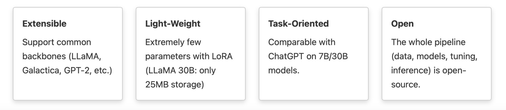

<p align="center" width="100%">

</p>

# LMFlow

<h4 align="center">
    <p>
        <a href="https://github.com/OptimalScale/LMFlow/blob/main/README.md">English</a> |
        <b>简体中文</b> |
        <a href="https://github.com/OptimalScale/LMFlow/blob/main/README_es.md">Español</a> |
        <a href="https://github.com/OptimalScale/LMFlow/blob/main/README_jp.md">日本語</a>
    <p>
</h4>

[](https://github.com/OptimalScale/LMFlow/blob/main/LICENSE)
[](https://www.python.org/downloads/release/python-390/)
[](https://optimalscale.github.io/LMFlow/)
[](https://discord.gg/srGxyazbNs)
[](https://i.328888.xyz/2023/04/04/ibvpAk.jpeg)
[](https://join.slack.com/t/lmflow/shared_invite/zt-1s6egx12s-THlwHuCjF6~JGKmx7JoJPA)

一个可扩展、方便和高效的工具箱，用于微调大型机器学习模型。我们的目标是开发一套用户友好、快速可靠，并对整个社区开放的全流程微调代码库。

所有人的大语言模型。请查看我们的[愿景](https://github.com/OptimalScale/LMFlow#vision)


<p align="center" width="100%">

</p>


## Latest News
* [2023-04-02] [Web service is online!](https://lmflow.com/)
* [2023-04-01] [Release Chinese checkpoints in model zoo: LLaMA-7B-tuned, LLaMA-13B-tuned, LLaMA-33B-tuned.](https://github.com/OptimalScale/LMFlow#model-zoo)
* [2023-04-01] [Release English checkpoints in model zoo: LLaMA-7B-medical, LLaMA-13B-medical, and LLaMA-33B-medical.](https://github.com/OptimalScale/LMFlow#model-zoo)
* [2023-03-27] [Support full tuning and lora tuning for all decoder models.](https://github.com/OptimalScale/LMFlow#supported-models) 
* [2023-03-27] [Tasked tuned model beats ChatGPT on medical domain](https://github.com/OptimalScale/LMFlow#model-performance)
* [2023-03-27] [Release code and checkpoints - version 0.0.1](https://optimalscale.github.io/LMFlow/)

## Demos

### 当前我们的检查点下载服务已满负荷。我们增加了一个服务器来支持该服务。如果您遇到"_too many HTTP requests_"的错误，请等待几分钟后再试。谢谢您的理解。

我们提供四种演示，包括：
- 在线服务：如果您不想运行任何代码，只是想尝试我们的模型，我们部署了调整指令的LLaMA-7B和LLaMA-33B供您尝试。
- Colab Chatbot (shell)：一个基于交互式shell的聊天机器人，让您可以轻松在Colab上部署聊天机器人。
- Colab Chatbot (web)：一个基于交互式Web的聊天机器人，让您可以轻松在Colab上部署自己的聊天机器人。
- 本地部署：我们还提供一种方式，让您可以在本地部署模型/聊天机器人，这意味着如果您有足够的资源，您可以部署比前三种方法更大的模型。


[](https://lmflow.com)
[%20%20chatbot:%20gpt--neo-orange?logo=google-colab&amp)](https://colab.research.google.com/drive/1P9Hf6_mLE7WHH92pw73j9D5kz6GTdkow?usp=sharing)
[%20%20chatbot:%20gpt--neo-blue?logo=google-colab&amp)](https://colab.research.google.com/drive/1LLtiiQO-ZIIFsTKxYzGWYX9BDRc-v8dq?usp=sharing)


### Online Service
>欢迎访问我们的[在线演示](https://lmflow.com/)。我们部署了经过LLaMA-7B和LLaMA-33B调整指令的模型进行预览。由于网站访问量较高，有时网站可能无法响应。您也可以参考“本地部署”来部署自己的聊天机器人。

### Colab chatbot(shell)
<p align="center" width="100%">

</p>


我们提供了一个使用Google Colab的T4/P100/V100 GPU的聊天机器人简单shell演示。请注意，提供的gpt-neo-2.7b模型是相对较弱的模型，仅支持英文，并且有时会生成不理想的响应。为了改善性能，用户可以使用自己的数据集进行微调，并使用LMFlow获得更好的模型。也可以尝试其他可用的仅解码器（decoder only）模型。
🤗 [huggingface](https://huggingface.co/models?pipeline_tag=text-generation&sort=downloads), by

```sh
./scripts/run_chatbot.sh {another-model-name}
```
### Colab chatbot (web)
我们提供了一个使用Google Colab的T4/P100/V100 GPU的聊天机器人简单web演示。请注意，提供的gpt-neo-2.7b模型是相对较弱的模型，仅支持英文，并且有时会生成不理想的响应。


### Local Deploy
如果您有资源并想在本地部署自己的模型，我们为您提供了一种简单的方法，可以通过以下方式运行一个Flask服务器来启动后端（以进一步向其他前端提供服务），并提供一个交互式Web前端（让您直接开始聊天）：
```sh
cd ./service
python app.py
```

## Medical Performance

|                |  PubMedQA (ID) | MedQA-USMLE (OOD) | MedMCQA (ID) |  Average |
|:---------:|:--------:|:-----------:|:-------:|:----:|
| Human (pass)   |  60.0   |     50.0    |         |      |
| Human (expert) |    78.0   |     87.0    |  90.0   | 85.0 |
|   |      |              |    |  |
|  InstructGPT 175B   |   73.2   |     46.0    |  44.0   | 54.4 |
|    ChatGPT |    63.9   |     **57.0**    |  44.7   | 55.2 |
|      LLaMA 7B   |    5.2   |     27.1    |  24.3   | 18.9 |
|      LLaMA 33B |    1.8   |     43.4    |  30.3   | 25.2 |
|   |      |             |            |    |  |
|   Task-tuned LLaMA 7B (Full) |   **75.1**   |     44.5    |  49.9   | 56.5 |
| Task-tuned LLaMA 33B (LoRA) |  74.0  |  51.3   | **50.2**|**58.5**|

LLaMA 33B（LoRA）的性能仅经过约16小时的微调，即可在PubMedQA和MedMCQA的训练集上使用单个8 * A100服务器实现。要了解更多性能信息，包括指令微调结果，请参考我们的[Documentation](https://optimalscale.github.io/LMFlow/)

## Model Zoo
我们将训练好的检查点开源给所有人进行进一步的训练和推理。

| Instruct-tuned Models   |  Status | Base Model | Download | 
|----------|:-------------:|----------|:-------------:|
| LLaMA-7B-tuned |  | LLaMA-7B | [Google Drive](https://drive.google.com/file/d/1x5JLae3akVkfFeDhSe3TEyUbPn_GNFyb/view?usp=share_link) |
| LLaMA-13B-tuned |  | LLaMA-13B |  [Google Drive](https://drive.google.com/file/d/1m_rpe6rNpN59kWvjJ3GfKeEmS-68TRYr/view?usp=share_link) |
| LLaMA-33B-tuned |  |LLaMA-33B |  [Google Drive](https://drive.google.com/file/d/1IqgqLHwNkWQ7BffheZnqD6a-8Zul1bk6/view?usp=share_link) |
| LLaMA-65B-tuned |  | LLaMA-65B | Google Drive |
| LLaMA7B-medical |  | LLaMA-7B | [Google Drive](https://drive.google.com/file/d/1Z44tsrRvfDFvucbNGFjHC_vbPcBvg3x-/view?usp=share_link) |
| LLaMA13B-medical |  | LLaMA-13B |  [Google Drive](https://drive.google.com/file/d/1uoTAXTMyYQkP6N4ummx7tj-c4v1p91ap/view?usp=share_link) |
| LLaMA33B-medical |  |LLaMA-33B |  [Google Drive](https://drive.google.com/file/d/14N9o_1pwHmVuSikQ3orMVzZDrLYJC0iM/view?usp=share_link) |
| LLaMA65B-medical |  | LLaMA-65B | Google Drive |


## Supported Pipelines

| Pipelines   |   Status |
|----------|:-------------:|
| Task Tuning |  :white_check_mark: Supported |
| Instruction Tuning |  :white_check_mark: Supported |
| Parameter-Efficient Tuning |  :white_check_mark: Supported |
| Large Model Inference |  :white_check_mark: Supported |
| Alignment Tuning |  :wrench: Developing |


## Supported Models

我们支持🤗 huggingface中的所有[decoder models](https://huggingface.co/models?pipeline_tag=text-generation&sort=downloads)，包括LLaMA、GPT2、GPT-Neo和Galactica等，均已进行了全面测试。我们很快将支持编码器（encoder-decoder）模型。


## 1.Setup
```bash
git clone https://github.com/OptimalScale/LMFlow.git
cd LMFlow
conda create -n lmflow python=3.9 -y
conda activate lmflow
conda install mpi4py
pip install -e .
```

## 2.Prepare Dataset
您可以通过以下指令下载训练数据集和测试数据集:
```bash
cd data
bash download.sh all
cd -
``` 

您也可以将您的数据转换成以下格式来使用自己的数据集:
```json
{
  "type": "text2text",
  "instances": [
    {
      "input": "Question: The Transformer architecture [START_REF]",
      "output": "N/A"
    },
    ...
  ]
}
```
```json
{
  "type": "text_only",
  "instances": [
    {
      "text": "Defintion: In this task, we ask you to write an answer to a question that involves events that may be stationary (not changing over time) or transient (changing over time). For example, the sentence \"he was born in the U.S.\" contains a stationary event since it will last forever; however, \"he is hungry\" contains a transient event since it will remain true for a short period of time. Note that a lot of the questions could have more than one correct answer. We only need a single most-likely answer. Please try to keep your \"answer\" as simple as possible. Concise and simple \"answer\" is preferred over those complex and verbose ones. \n Input: Question: Sentence: It's hail crackled across the comm, and Tara spun to retake her seat at the helm. \nQuestion: Will the hail storm ever end? \n Output: NA \n\n"
    },
    ...
  ]
}
```
## 3. Run Scripts
### 3.1 Run Finetuning

您可以通过运行 `scripts/run_finetune.sh` 来微调一个GPT-2的模型
```sh
./scripts/run_finetune.sh
```

如果您想要提供反映您机器设置的deepspeed参数，可以将相应的deepspeed参数传递给脚本。例如：
```sh
./scripts/run_finetune.sh "--num_gpus=8 --master_port 10001"
```

为了开启LoRA的训练，您可以参考:
```sh
./scripts/run_finetune_with_lora.sh
```

如果需要详细的配置，可以直接修改这些脚本。这些脚本实际上只是调用了python脚本`examples/finetune.py`，该脚本可以按以下方式运行：

```sh
deepspeed ${deepspeed_args} \
  examples/finetune.py \
    --deepspeed configs/ds_config_zero3.json \
    --bf16 \
    --run_name finetune_with_lora \
    --model_name_or_path facebook/galactica-1.3b \
    --num_train_epochs 0.01 \
    --learning_rate 2e-5 \
    --dataset_path ${dataset_path} \
    --per_device_train_batch_size 1 \
    --per_device_eval_batch_size 1 \
    --validation_split_percentage 0 \
    --logging_steps 20 \
    --block_size 512 \
    --do_train \
    --output_dir output_models/finetune \
    --overwrite_output_dir \
    --ddp_timeout 72000 \
    --save_steps 5000 \
    --dataloader_num_workers 1
```

```python
python examples/finetune.py -h
```

### 3.2 Run Evaluation

大家可以通过以下方式来对训练好的模型进行测评:
```sh
./scripts/run_evaluation.sh
```

`--model_name_or_path` 指定了模型存储的位置。

对于LoRA模型的测评，执行以下指令:
```sh
./scripts/run_evaluation_with_lora.sh
```

这些脚本调用了基于我们API构建的示例`examples/*.py`。要获取更多与API相关的示例，可以参考单元测试中的方法`tests`.


## 4. Additional Notes
### 4.1 LLaMA Checkpoint

首先，您需要从[facebookresearch/llama](https://github.com/facebookresearch/llama)获取LLaMA模型的访问权限。下载官方检查点并将其保存到`${llama-path}`中。

其次，通过运行以下命令将官方检查点`${llama-path}`转换为HuggingFace支持的检查点`${llama-hf-path}`：

    `python ./scripts/convert_llama_weights_to_hf.py --input_dir ${llama-path} --model_size 7B --output_dir ${llama-hf-path}/llama-7b-hf`

然后，将检查点路径设置为`${llama-hf-path}/llama-7b-hf`即可开始使用。祝您使用愉快！

现在，您已经拥有了原始的llama-7b-hf预训练模型。


### 4.2 DeepSpeed Config
您可以在config文件夹下设置DeepSpeed的config，具体可以参考 [DeepSpeed Configuration](https://www.deepspeed.ai/docs/config-json/)

## 5. Model Release

### 5.1 Medical Model Checkpoints
您可以运行以下脚本来下载我们的权重:

```bash
cd output_models
bash download.sh medical_ckpt
cd -
```
您可以直接通过Google Drive下载我们的模型: [medical_ckpt.tar.gz](https://drive.google.com/file/d/1bnsQGNGNYchsOfiNyRAmL2fNiowbmFNw/view?usp=share_link)

### 5.2 Instruction Model Checkpoints
```bash
cd output_models
bash download.sh instruction_ckpt
cd -
```
您可以直接通过Google Drive下载我们的模型: [instruction_ckpt.tar.gz](https://drive.google.com/file/d/1d_ioQ-ViVweeifbsFSO4pczc3UORFHZO/view?usp=share_link)

### 5.3 Begin Reproduce
在下载了模型Checkpoints之后，您可以在`LMFlow/scripts/run_evaluation_with_lora.sh`中将`--lora_model_path`替换为`output_models/instruction_ckpt/llama7b-lora`（以instruction的llama-7b为例），并将--model_name_or_path替换为您转换的llama模型。然后运行这个shell脚本以重现结果。

然后，您可以在我们的文档中检查模型性能。

## Documentation
请参考我们的[Documentation](https://optimalscale.github.io/LMFlow/)获取更多API参考和实验结果信息。

## Vision
我们很高兴地开源LMFlow代码库，其中包括了完整的大模型训练流程，能够快速、高效地训练和部署自己的语言模型。

我们的代码库不仅仅是一个简单的模型； 它包括完整的训练流程、模型权重和测试工具。 您可以使用它来构建各种类型的语言模型，包括对话模型、问答模型和文本生成模型等。

此外，我们旨在创建一个开放和民主的大模型共享平台，任何人都可以在这个平台上分享训练模型权重和经验。 我们欢迎任何对大模型感兴趣的人参与进来，与我们一起建设一个开放友好的社区！

无论您是初学者还是专家，我们相信大家都能从这个平台中获益。让我们共同努力，建立一个充满活力和创新的大模型社区！

[](https://discord.gg/srGxyazbNs)
[](https://i.328888.xyz/2023/04/04/ibvpAk.jpeg)
[](https://join.slack.com/t/lmflow/shared_invite/zt-1s6egx12s-THlwHuCjF6~JGKmx7JoJPA)

## Disclaimer

此软件包旨在为大型模型调整提供简化和用户友好的流程。其功能可作为用户参考并供用户使用。然而，需要注意的是，数据和预训练模型的准备工作完全由用户负责。本软件包不保证用户准备组件的准确性、完整性、适用性或合法性。用户必须了解并承担与模型和数据准备相关的所有风险和责任，并在使用本软件包之前获取法律、商业和技术建议。该流程不应对用户不当准备数据和预训练模型所导致的任何直接、间接、特殊、偶然或后果性损害负责。

我们提供的检查点仅供研究目的使用，包括英文和中文版本。这些检查点包含ChatGPT语言模型生成的结果。我们不支持或鼓励将这些检查点用于商业目的的分发或使用。这些检查点的用户应当负责确保正确和适当地使用它们。

还需要强调的是，模型生成的结果是基于概率模型，与此流程没有直接关系。本流程不保证结果的准确性、可靠性、适用性和合法性。因此，在依赖模型生成的结果之前，用户还必须了解与结果相关的风险和责任，并寻求法律、商业和技术建议。该流程不应对用户依赖模型生成的结果所导致的任何直接、间接、特殊、偶然或后果性损害负责。

## Support
如果您需要任何帮助，请提交[Github](https://github.com/OptimalScale/LMFlow)问题。


## Contributors
<a href="https://github.com/OptimalScale/LMFlow/graphs/contributors">
  
</a>

## Citation
如果您觉得我们的软件包有用，欢迎点赞⭐、fork、转发和引用。谢谢大家的支持！

```
@misc{lmflow,
  author = {Shizhe Diao and Rui Pan and Hanze Dong and KaShun Shum and Jipeng Zhang and Wei Xiong and Tong Zhang},
  title = {LMFlow: An Extensible Toolkit for Finetuning and Inference of Large Foundation Models},
  year = {2023},
  publisher = {GitHub},
  journal = {GitHub repository},
  howpublished = {\url{https://optimalscale.github.io/LMFlow/}},
}
```
