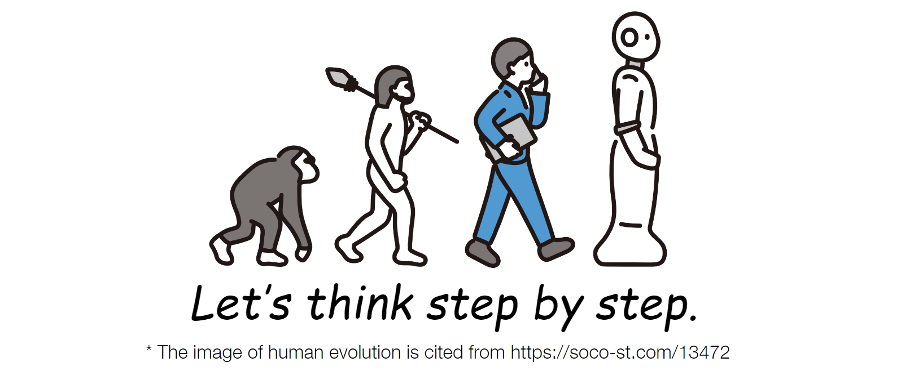

# Large Language Models are Zero-Shot Reasoners

This is the official implementation of `Large Language Models are Zero-Shot Reasoners` (Accepted at NeurIPS 2022).

The paper is available at [NeurIPS 2022](https://proceedings.neurips.cc/paper_files/paper/2022/hash/8bb0d291acd4acf06ef112099c16f326-Abstract-Conference.html) and [arXiv](https://arxiv.org/abs/2205.11916).

<div align="center">

</div>

## Installation
Make sure you have Python>=3.8 installed on your machine.
```
pip install torch==1.8.2+cu111 torchtext==0.9.2 -f https://download.pytorch.org/whl/lts/1.8/torch_lts.html
pip install -r requirements.txt
```

## Set your OpenAI API key
```
# https://beta.openai.com/account/api-keys
export OPENAI_API_KEY=(YOUR OPENAI API KEY)
```

## Set arguments.
```
# Notes: this experiment uses InstructGPT models.
# https://platform.openai.com/docs/model-index-for-researchers
model=gpt3-xl # {"gpt3", "gpt3-medium", "gpt3-large", "gpt3-xl"}. "gpt3" is the smallest model.
dataset=multiarith # We can use other datasets. See help for the details.
limit_dataset_size=10 # This is important to save your budget. If you want to use all the samples in a dataset, set 0.
api_time_interval=1.0 # Caution. The API allows users request API up to 60 times in a minutes, otherwise errors happen.
```

## Quick Start

### Zero-shot-CoT (our proposal)
```
python main.py --method=zero_shot_cot --model=${model} --dataset=${dataset}
```

### Zero-shot
```
python main.py --method=zero_shot --model=${model} --dataset=${dataset}
```

### Few-shot-CoT
```
# MultiArith and GSM8K are currently available.
python main.py --method=few_shot_cot --model=${model} --dataset=${dataset}
```

### Few-shot
```
# MultiArith and GSM8K are currently available.
python main.py --method=few_shot --model=${model} --dataset=${dataset}
```

## Citation
```
@inproceedings{NEURIPS2022_8bb0d291,
 author = {Kojima, Takeshi and Gu, Shixiang (Shane) and Reid, Machel and Matsuo, Yutaka and Iwasawa, Yusuke},
 booktitle = {Advances in Neural Information Processing Systems},
 pages = {22199--22213},
 title = {Large Language Models are Zero-Shot Reasoners},
 volume = {35},
 year = {2022}
}
```
