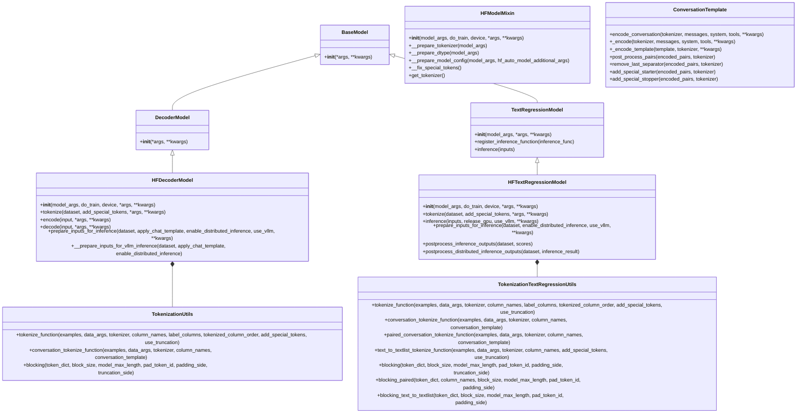
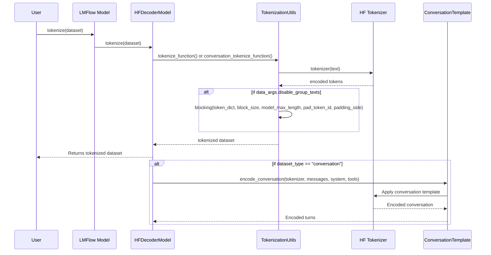

### Tokenization in LMFlow

##### Class Structure

```mermaid
classDiagram
    class BaseModel {
        +__init__(*args, **kwargs)
    }
    
    class HFModelMixin {
        +__init__(model_args, do_train, device, *args, **kwargs)
        +__prepare_tokenizer(model_args)
        +__prepare_dtype(model_args)
        +__prepare_model_config(model_args, hf_auto_model_additional_args)
        +__fix_special_tokens()
        +get_tokenizer()
    }
    
    class DecoderModel {
        +__init__(*args, **kwargs)
    }
    
    class HFDecoderModel {
        +__init__(model_args, do_train, device, *args, **kwargs)
        +tokenize(dataset, add_special_tokens, *args, **kwargs)
        +encode(input, *args, **kwargs)
        +decode(input, *args, **kwargs)
        +prepare_inputs_for_inference(dataset, apply_chat_template, enable_distributed_inference, use_vllm, **kwargs)
        +__prepare_inputs_for_vllm_inference(dataset, apply_chat_template, enable_distributed_inference)
    }
    
    class TextRegressionModel {
        +__init__(model_args, *args, **kwargs)
        +register_inference_function(inference_func)
        +inference(inputs)
    }
    
    class HFTextRegressionModel {
        +__init__(model_args, do_train, device, *args, **kwargs)
        +tokenize(dataset, add_special_tokens, *args, **kwargs)
        +inference(inputs, release_gpu, use_vllm, **kwargs)
        +prepare_inputs_for_inference(dataset, enable_distributed_inference, use_vllm, **kwargs)
        +postprocess_inference_outputs(dataset, scores)
        +postprocess_distributed_inference_outputs(dataset, inference_result)
    }
    
    class TokenizationUtils {
        +tokenize_function(examples, data_args, tokenizer, column_names, label_columns, tokenized_column_order, add_special_tokens, use_truncation)
        +conversation_tokenize_function(examples, data_args, tokenizer, column_names, conversation_template)
        +blocking(token_dict, block_size, model_max_length, pad_token_id, padding_side, truncation_side)
    }
    
    class TokenizationTextRegressionUtils {
        +tokenize_function(examples, data_args, tokenizer, column_names, label_columns, tokenized_column_order, add_special_tokens, use_truncation)
        +conversation_tokenize_function(examples, data_args, tokenizer, column_names, conversation_template)
        +paired_conversation_tokenize_function(examples, data_args, tokenizer, column_names, conversation_template)
        +text_to_textlist_tokenize_function(examples, data_args, tokenizer, column_names, add_special_tokens, use_truncation)
        +blocking(token_dict, block_size, model_max_length, pad_token_id, padding_side, truncation_side)
        +blocking_paired(token_dict, column_names, block_size, model_max_length, pad_token_id, padding_side)
        +blocking_text_to_textlist(token_dict, block_size, model_max_length, pad_token_id, padding_side)
    }
    
    class ConversationTemplate {
        +encode_conversation(tokenizer, messages, system, tools, **kwargs)
        +_encode(tokenizer, messages, system, tools, **kwargs)
        +_encode_template(template, tokenizer, **kwargs)
        +post_process_pairs(encoded_pairs, tokenizer)
        +remove_last_separator(encoded_pairs, tokenizer)
        +add_special_starter(encoded_pairs, tokenizer)
        +add_special_stopper(encoded_pairs, tokenizer)
    }
    
    BaseModel <|-- DecoderModel
    BaseModel <|-- TextRegressionModel
    DecoderModel <|-- HFDecoderModel
    TextRegressionModel <|-- HFTextRegressionModel
    HFDecoderModel *-- TokenizationUtils
    HFTextRegressionModel *-- TokenizationTextRegressionUtils

```

##### Sequence Diagram

```mermaid
    sequenceDiagram
    participant User
    participant Model as LMFlow Model
    participant HFDecoderModel
    participant TokenizationUtils
    participant Tokenizer as HF Tokenizer
    participant ConversationTemplate
    
    %% Main tokenization sequence
    User->>Model: tokenize(dataset)
        
    %% Tokenization for decoder model
    Model->>HFDecoderModel: tokenize(dataset)
    HFDecoderModel->>TokenizationUtils: tokenize_function() or conversation_tokenize_function()
    TokenizationUtils->>Tokenizer: tokenizer(text)
    Tokenizer-->>TokenizationUtils: encoded tokens
    
    alt if data_args.disable_group_texts
        TokenizationUtils->>TokenizationUtils: blocking(token_dict, block_size, model_max_length, pad_token_id, padding_side)
    end
    
    TokenizationUtils-->>HFDecoderModel: tokenized dataset
    HFDecoderModel-->>User: Returns tokenized dataset
    
    %% For conversation data
    alt if dataset_type == "conversation"
        HFDecoderModel->>ConversationTemplate: encode_conversation(tokenizer, messages, system, tools)
        ConversationTemplate->>Tokenizer: Apply conversation template
        Tokenizer-->>ConversationTemplate: Encoded conversation
        ConversationTemplate-->>HFDecoderModel: Encoded turns
    end
```