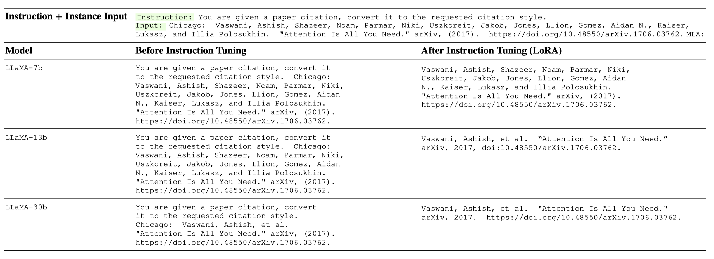

# LMFlow

An extensible, convenient, and efficient toolbox for finetuning large machine learning models, designed to be user-friendly, speedy and reliable, and accessible to the entire community.

```{eval-rst}
.. grid:: 1 2 3 4

    .. grid-item-card::  Extensible

        Support common backbones (LLaMA, Galactica, GPT-2, etc.)

    .. grid-item-card::  Light-Weight

        Extremely few parameters with LoRA  (LLaMA 33B: only 25MB storage) 

    .. grid-item-card::  Task-Oriented

      Comparable with ChatGPT on 7B/33B models.

    .. grid-item-card::  Open

        The whole pipeline (data, models, tuning, inference) is open-source.


```

## Introduction

The remarkable achievements of large foundation models, such as the expansive language models, have demonstrated their exceptional capacity to attain human-like intelligence that surpasses conventional methods. Despite their growing accessibility, these models still require fine-tuning to cater to specific tasks while maintaining their overall AI competency. We are pleased to introduce our lightweight toolkit, which features thoughtfully designed and easily scalable APIs. This tool simplifies the process of fine-tuning and inference of publicly available foundation models to maximize their effectiveness.

We have thoroughly tested this toolkit and are pleased to make it available under [Github](https://github.com/OptimalScale/LMFlow).


## Features


### Task Tuning

The goal of Task Tuning is to enhance a language model's proficiency in a particular field, such as medicine or mathematics. By doing so, the model acquires domain-specific information, allowing it to adapt better to the target subject matter.

For instance, if a medical dataset is used for task tuning, the language model can gain medical knowledge that can be applied to other medical datasets.

To emphasize its significance, we applied task tuning to LLaMA models on PubMedQA and MedMCQA datasets and evaluated their performance. We observed significant improvements both in-domain (PubMedQA, MedMCQA) and out-of-domain (MedQA-USMLE) dataset.


|                |  PubMedQA | MedQA-USMLE | MedMCQA |  Average |
|:---------:|:--------:|:-----------:|:-------:|:----:|
| Human (pass)   |  60.0   |     50.0    |         |      |
| Human (expert) |    78.0   |     87.0    |  90.0   | 85.0 |
|   |      |              |    |  |
|  InstructGPT 175B   |   73.2   |     46.0    |  44.0   | 54.4 |
|    ChatGPT     |    63.9   |     **57.0**    |  44.7   | 55.2 |
|      LLaMA 7B   |    5.2   |     27.1    |  24.3   | 18.9 |
|      LLaMA 33B |    1.8   |     43.4    |  30.3   | 25.2 |
|   |      |             |            |    |  |
|   Task-tuned LLaMA 7B (Full) |   **75.1**   |     44.5    |  49.9   | 56.5 |
| Task-tuned LLaMA 33B (LoRA) |  74  |  51.3   | **50.2**|**58.5**|


Moreover, we also test the MMLU performance to further verify the out-of-domain robustness of Task Tuning technique.


|    MMLU task    | anatomy | clinical knowledge | college biology | college medicine | medical genetics | professional medicine |
|:-----------:|:-------:|:-----------:|:---------:|:----------:|:----------:|:---------------:|
|    LLaMA 33B    |   39.2  |        40.3        |       44.4      |       32.9       |        36        |          43.0         |
|  Galactica 30B  |   32.5  |         26         |       30.5      |       25.4       |        39        |          23.1         |
|  Galactica 120B |   58.5  |        59.2        |       68.7      |       57.2       |       68.0       |          59.6         |
|     OPT 175B    |   28.9  |        21.9        |       30.6      |         -        |       35.0       |          27.9         |
|    BLOOM 176B   |    37   |        29.8        |       28.5      |         -        |       36.0       |          25.4         |
|   Gopher 280B   |   56.3  |        67.2        |       70.8      |       60.1       |       69.0       |          64.0         |
|   GPT3.5 175B   |   56.3  |        69.8        |       72.2      |       61.3       |        70        |          70.2         |
|                 |         |                    |                 |                  |                  |                       |
| Task-tuned LLaMA 33B (LoRA)  |   51.8  |        65.2        |       70.1      |       58.3       |       65.6       |          66.5         |


### Instruction Tuning

Instruction Tuning is a technique used to improve the performance of language models by training them to follow natural language commands or instructions. This includes positive or negative examples, prompts, constraints, and other elements that are commonly found in human language.   The main goal of instruction-tuning is to improve the model's ability to perform well on multiple tasks and to generalize more effectively to new or unseen tasks. This is achieved by teaching the model to understand and incorporate various language cues and constraints that are relevant to the task at hand.  Instruction-tuning is a powerful technique that is widely used in natural language processing, machine learning, and related areas. By improving the ability of language models to understand and follow natural language commands, this approach can help to unlock new levels of performance and productivity in a wide range of applications.

We list some examples below. Full example list is saved as a [Jsonl file](https://github.com/OptimalScale/LMFlow/blob/main/docs/source/_static/check_before_after_lora_tuning.jsonl).





## Installation


This package can be be installed from sources with the following command:

```bash
git clone https://github.com/OptimalScale/LMFlow.git

conda create -n lmflow python=3.9 -y

conda activate lmflow

conda install mpi4py

pip install -e .
```


## Checkpoints

We have prepared tuned LLaMA model (both task and instruction tuning).


Refer to [README](https://github.com/OptimalScale/LMFlow/blob/main/README.md).


## Content

```{toctree}
:maxdepth: 1

blogs/index
```

```{toctree}
:maxdepth: 2

examples/index
```

```{toctree}
:maxdepth: 2

autoapi/index
```

```{toctree}
:maxdepth: 2

about/index
```

## Citation

```bibtex
@misc{lmflow,
  author = {Shizhe Diao and Rui Pan and Hanze Dong and KaShun Shum and Jipeng Zhang and Wei Xiong and Tong Zhang},
  title = {LMFlow: An Extensible Toolkit for Finetuning and Inference of Large Foundation Models},
  year = {2023},
  publisher = {GitHub},
  journal = {GitHub repository},
  howpublished = {\url{https://optimalscale.github.io/LMFlow/}},
}
```


## Disclaimer

This package aims to provide a streamlined and user-friendly pipeline for large model tuning. Its functionalities serve as a reference and are intended for use by the user. However, it is important to note that the responsibility for the preparation of the data and pretrained models lies solely with the user. This package does not guarantee the accuracy, completeness, applicability, or legality of the components from the user's preparation. Users must be aware of and assume all risks and liabilities associated with the preparation of the models and data, and obtain legal, commercial, and technical advice before utilizing this package. The pipeline shall not be held responsible for any direct, indirect, special, incidental, or consequential damages resulting from the user's improper preparation of the data and pretrained models.   

It is also crucial to highlight that the results generated by the model are based on probabilistic models and not directly related to this pipeline. The accuracy, reliability, applicability, and legality of the results are not guaranteed by this pipeline. Therefore, users must also be aware of the risks and liabilities associated with the results and seek legal, commercial, and technical advice before relying on the model-generated outcomes. This pipeline shall not be accountable for any direct, indirect, special, incidental, or consequential damages resulting from the user's reliance on the model-generated results.


## Support

If you need any help, please submit a [Github](https://github.com/OptimalScale/LMFlow) issue.

## Indices and tables

- {ref}`genindex`
- {ref}`search`
