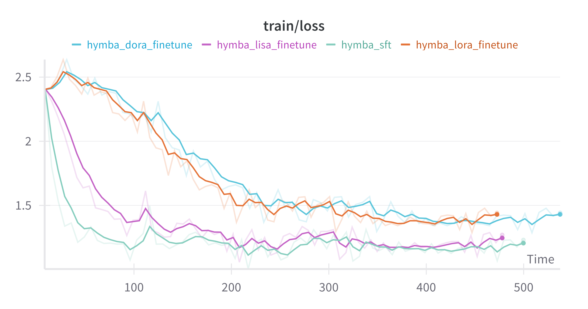

# Training Hymba with LMFlow

## Hymba 
[GITHUB](https://github.com/NVlabs/hymba/tree/main)  
Hymba is a family of small language models (SLMs) featuring a hybrid-head parallel architecture that integrates transformer attention mechanisms with SSMs to achieve the best of both worlds: enhanced efficiency and improved performance. In Hymba, attention heads provide high-resolution recall, while SSM heads enable efficient context summarization.

## Preparing the environment

- Using Docker 

```bash
docker pull ghcr.io/tilmto/hymba:v1
docker run --gpus all -v /home/$USER:/home/$USER -it ghcr.io/tilmto/hymba:v1 bash
```

- Install LMFlow in the docker container

```bash
git clone https://github.com/OptimalScale/LMFlow.git
cd LMFlow
conda create -n lmflow python=3.9 -y
conda activate lmflow
conda install mpi4py
pip install -e .
```

- Tips

For training the Hymba model, please add below arguments to the `run_finetune.sh` script:

```bash
--trust_remote_code True
--bf16
```

Demo script: [run_finetune_hymba.sh](./run_finetune_hymba.sh)

Recommend on the A100, H100, A40 GPUs.


## Training Loss
The training loss curve for `nvidia/Hymba-1.5B-Instruct`, fine-tuned on the `MedMCQA/train` dataset with a learning rate of $5e-5$ over 100 steps using SFT, LoRA, LISA, and DORA, is shown below:
